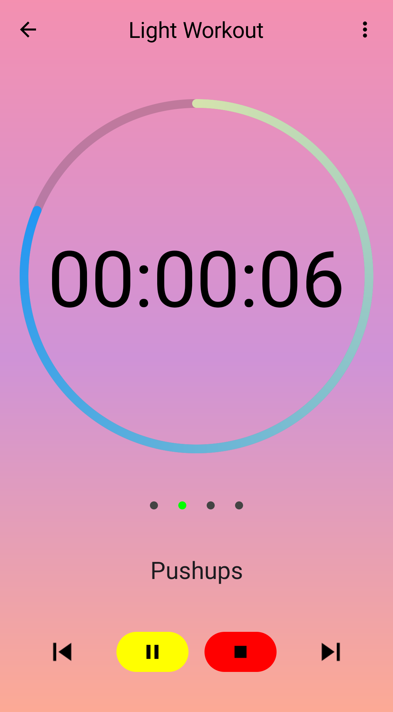

This project was fully rebuilt from single Activity many Fragment design with xml-based UI, into the new declarative UI coding style of Jetpack Compose. It also makes use of many Jetpack components like Room, DataStore, Lifecycle, and Navigation. It implements MVVM architecture (with Hilt Dagger DI), unidirectional data flow, and Material You (Material Design 3).

#### _[Now on the Google Play Store](https://play.google.com/store/apps/details?id=com.augustbyrne.tas)_

 | 

[Privacy Policy](privacy-policy.md)
