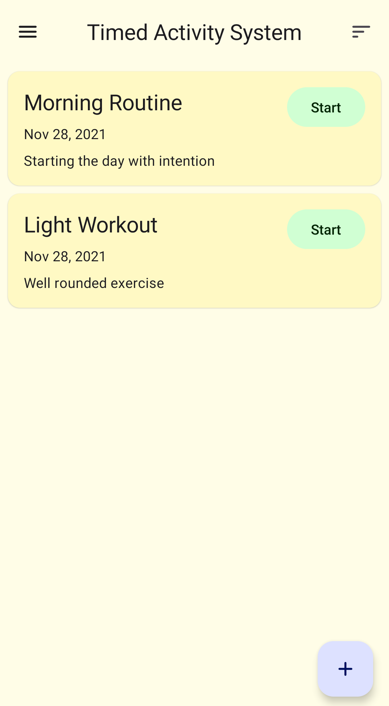

Plan out your activities with TAS!

TAS helps you stay organized and manage your daily activities effectively using timed tasks and routines.

<em>

<a href="https://play.google.com/store/apps/details?id=com.augustbyrne.tas" target="_blank">Now on the Google Play Store</a>

</em>

 |  | 

This project was fully rebuilt from a multi-fragment and xml design into the new declarative UI coding style of Jetpack Compose. It also makes use of many Jetpack components like Room, DataStore, Lifecycle, and Navigation. It implements MVVM architecture (with Hilt Dagger DI), unidirectional data flow, and Material You. It also makes use of a few of the accompanist libraries by Google.

[Privacy Policy](privacy-policy.md)
